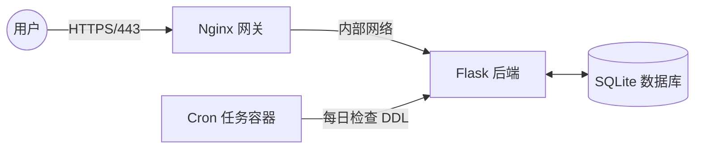

# 📝 Todo List System (V3.1) - 生产级全栈容器化部署

基于 Python Flask 的待办事项管理系统。本项目已从 V1.0 单体应用演进至 **V3.1 微服务架构**，实现了全链路容器化、自动化运维及 HTTPS 安全加固。

---

## 🏗️ 系统架构 (Architecture)



  * **Nginx (Reverse Proxy):** 负责 SSL 卸载、静态资源转发，隐藏后端真实端口。
  * **Flask (App):** 核心 RESTful API 服务，使用 Gunicorn 生产级服务器运行。
  * **Cron (Worker):** 独立容器，负责定时执行邮件提醒任务，与业务逻辑解耦。

-----

## ✨ 核心特性

  * ✅ **RESTful API:** 标准 CRUD 接口设计。
  * ✅ **生产级安全:** 强制 HTTPS (TLS 1.2+)，后端端口对公网封闭，仅允许 Nginx 访问。
  * ✅ **前后端分离:** 原生 JS (Fetch API) 实现，无刷新交互体验。
  * ✅ **DevOps:** Docker Compose 一键编排，解决环境一致性问题。

-----

## 🚀 快速开始 (Quick Start)

### 1\. 克隆项目

```bash
git clone [https://github.com/yourname/todo-list.git](https://github.com/yourname/todo-list.git)
cd todo-list
```

### 2\. 生成 SSL 证书 (必需)

本项目启用 HTTPS，需在本地生成自签名证书（证书文件已被 .gitignore 忽略，需手动生成）：

```bash
mkdir -p nginx/ssl
openssl req -x509 -nodes -days 365 -newkey rsa:2048 \
    -keyout nginx/ssl/nginx.key \
    -out nginx/ssl/nginx.crt \
    -subj "/C=CN/ST=Beijing/L=Beijing/O=Dev/CN=localhost"
```

### 3\. 启动服务

```bash
# 构建镜像并后台运行
sudo docker-compose up -d --build
```

访问 `https://你的服务器IP` 即可。
*(注：因使用自签名证书，浏览器会提示不安全，请点击“继续访问”)*

-----

## ❓ 故障排除 (Troubleshooting)

### Q1: `docker-compose` 报错 `KeyError: 'ContainerConfig'`?

**A:** 这是旧版 Compose (v1.x) 与新版 Docker 引擎的兼容性问题。
**解决:** 不要使用 `restart`，请运行 `sudo docker rm -f todo-list_web_1` 手动清理容器，然后再次 `up -d`。

### Q2: 邮件发送时间不对？

**A:** 容器默认使用 UTC 时间。本项目已通过 `tzdata` 和 `TZ` 环境变量修正为 CST (北京时间)。

### Q3: Cron 报错 `python3: not found`?

**A:** Cron 运行环境 `$PATH` 极简。本项目已在 Crontab 中使用绝对路径 `/usr/local/bin/python3` 解决此问题。

-----
